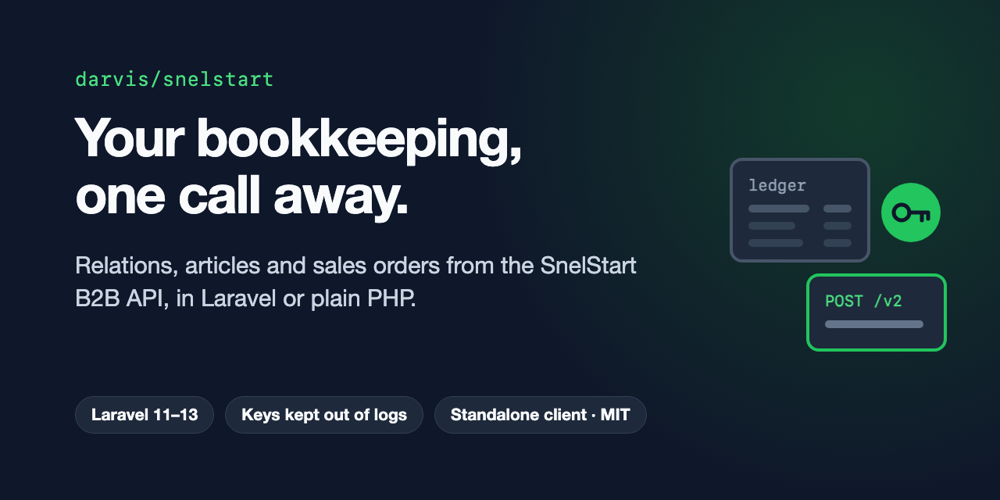

# SnelStart for Laravel

[](https://packagist.org/packages/darvis/snelstart)
[](https://github.com/ArvidDeJong/snelstart/actions/workflows/tests.yml)
[](https://packagist.org/packages/darvis/snelstart)
[](LICENSE)

A PHP client for the SnelStart B2B API v2, the API of the Dutch accounting software SnelStart. For Laravel, and for plain PHP.



## Features

- **Authentication handled** - the client key is exchanged for an access token, which is kept encrypted in the cache until it is about to expire, and replaced once when SnelStart refuses it
- **Relations, articles and sales orders** - and `get()`, `post()`, `put()`, `delete()` and `head()` for every other endpoint
- **A connection test** - `php artisan snelstart:test`, and an `EchoService` that never throws
- **A standalone client** - the same methods on cURL, for a project without Laravel
- **Safe with your keys** - never in a URL, and removed from error messages before they are thrown, logged or printed
- **Laravel Boost** - guideline and skill included, so an AI assistant in your app knows the API

## Requirements

- PHP 8.2+
- Laravel 11, 12 or 13
- A SnelStart client key and a subscription key of the B2B API
- The cURL extension, only for the standalone client

## Installation

```bash
composer require darvis/snelstart
```

```env
SNELSTART_CLIENT_KEY=your-client-key
SNELSTART_SUBSCRIPTION_KEY=your-subscription-key
```

```bash
php artisan snelstart:test
```

## Quick start

```php
use Darvis\Snelstart\Services\SnelstartAPI;

$snelstart = app(SnelstartAPI::class);

$company = $snelstart->getCompanyInfo();
$relations = $snelstart->getRelaties(['$top' => 50]);
$relation = $snelstart->createRelatie(['naam' => 'Example B.V.']);

$snelstart->put('/relaties/'.$relation['id'], $data);   // every other endpoint
```

A failed call throws a `RuntimeException` with the HTTP status and the response body. A 429 or a 5xx is not retried, and a request gives up after 30 seconds (`SNELSTART_TIMEOUT`).

Without Laravel:

```php
use Darvis\Snelstart\Standalone\SnelstartAPI;

$snelstart = new SnelstartAPI(['client_key' => $clientKey, 'subscription_key' => $subscriptionKey]);
// or: SnelstartAPI::fromEnv();
```

## Documentation

The full documentation lives on the [documentation site](https://arviddejong.github.io/snelstart/):

- [Installation](https://arviddejong.github.io/snelstart/installation.html): the package, the keys and the config
- [Quick start](https://arviddejong.github.io/snelstart/quickstart.html): the first calls
- [How it works](https://arviddejong.github.io/snelstart/concepts.html): authentication, the token cache, the retry on a refused token, timeouts and where the keys go
- [API reference](https://arviddejong.github.io/snelstart/api-reference.html)
- [Standalone client](https://arviddejong.github.io/snelstart/standalone.html): without Laravel, and how it differs
- [Testing](https://arviddejong.github.io/snelstart/testing.html): fake SnelStart in your tests
- [Troubleshooting](https://arviddejong.github.io/snelstart/troubleshooting.html)

## Testing

```bash
composer test      # Pest
composer lint      # Pint, check only; composer format fixes
composer analyse   # Larastan
```

## Changelog

See [CHANGELOG](CHANGELOG.md).

## Contributing

See [CONTRIBUTING](CONTRIBUTING.md).

## Security

Please report a vulnerability privately, as described in [SECURITY](SECURITY.md), not in the issue tracker.

## License

The MIT License (MIT). See [LICENSE](LICENSE).
